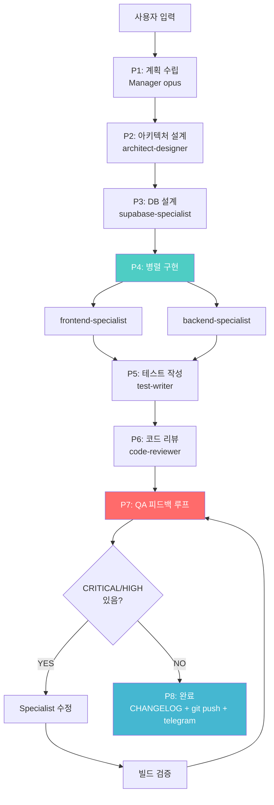
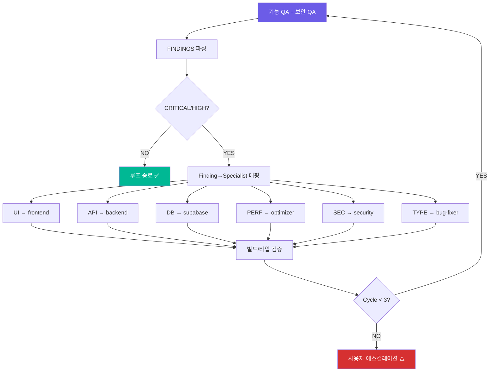
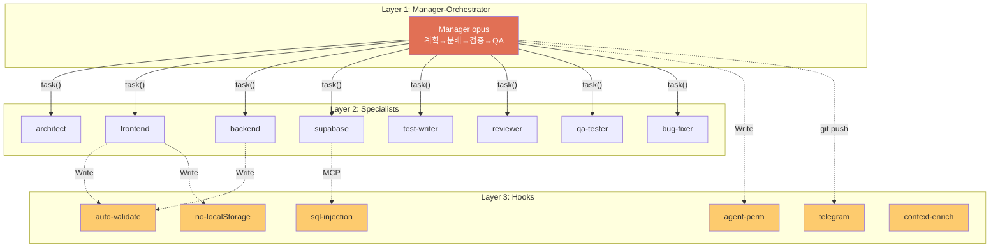

# Manager-Orchestrator 워크플로우 구조도

> 최종 업데이트: 2026-02-12
> 8-Phase 오케스트레이션 시스템의 전체 구조를 한눈에 파악하기 위한 문서

---

## 1. 시스템 3계층 아키텍처

```
┌─────────────────────────────────────────────────────────────────────────┐
│  👤 사용자 입력                                                          │
│  "Todo 앱 만들어줘" / "모바일 앱 만들어" / "API 서버 구현해"              │
└───────────────────────────────┬─────────────────────────────────────────┘
                                │
        ┌───────────────────────▼───────────────────────┐
        │     🧠 Layer 1: Manager-Orchestrator (opus)    │
        │                                                │
        │  ┌──────────────────────────────────────────┐  │
        │  │  역할: 계획 → 분배 → 검증 → QA → 완료    │  │
        │  │  원칙: 코드를 직접 쓰지 않음 (조율만)     │  │
        │  │  도구: Task, TaskCreate/Update/List,       │  │
        │  │        Bash, Read, Glob, Grep,             │  │
        │  │        Write (docs/*.md만 허용)            │  │
        │  └──────────────────────────────────────────┘  │
        └───────────────────────┬───────────────────────┘
                                │ task() 호출
        ┌───────────────────────▼───────────────────────┐
        │     🔧 Layer 2: Specialist Agents (sonnet)     │
        │                                                │
        │  ┌─────────────┐ ┌─────────────┐ ┌──────────┐ │
        │  │ architect-  │ │ frontend-   │ │ backend- │ │
        │  │ designer    │ │ specialist  │ │ specialist│ │
        │  └─────────────┘ └─────────────┘ └──────────┘ │
        │  ┌─────────────┐ ┌─────────────┐ ┌──────────┐ │
        │  │ supabase-   │ │ test-writer │ │ code-    │ │
        │  │ specialist  │ │             │ │ reviewer │ │
        │  └─────────────┘ └─────────────┘ └──────────┘ │
        │  ┌─────────────┐ ┌─────────────┐ ┌──────────┐ │
        │  │ web-qa-     │ │ bug-fixer   │ │ security-│ │
        │  │ tester      │ │             │ │ specialist│ │
        │  └─────────────┘ └─────────────┘ └──────────┘ │
        │  ┌─────────────┐ ┌─────────────┐ ┌──────────┐ │
        │  │ performance-│ │ devops-     │ │ telegram-│ │
        │  │ optimizer   │ │ specialist  │ │ notifier │ │
        │  └─────────────┘ └─────────────┘ └──────────┘ │
        └───────────────────────┬───────────────────────┘
                                │ Write/Edit/Bash 시 자동 트리거
        ┌───────────────────────▼───────────────────────┐
        │     🛡️ Layer 3: Hooks (자동 정책 강제)         │
        │                                                │
        │  PostToolUse (Edit|Write):                     │
        │    auto-validate.sh ─── TS/ESLint 자동 검증    │
        │    no-localstorage.sh ─ localStorage 사용 차단  │
        │    isPWA-check.sh ───── PWA 레이아웃 분기 강제  │
        │    agent-perm-check.sh─ Manager 코드 작성 차단  │
        │                                                │
        │  PostToolUse (Bash):                           │
        │    telegram-notify.sh ─ git push 후 알림 보장   │
        │                                                │
        │  PostToolUse (*):                              │
        │    sql-injection.sh ── Supabase SQL 인젝션 방지 │
        │                                                │
        │  UserPromptSubmit (*):                         │
        │    context-enrichment.sh ─ 컨텍스트 자동 주입   │
        └────────────────────────────────────────────────┘
```

---

## 2. 8-Phase 워크플로우 전체 흐름

```
사용자 입력
    │
    ▼
╔══════════════════════════════════════════════════════════════╗
║  P1  계획 수립              Manager (직접)                   ║
║      산출물: docs/plan.md, TaskCreate × N                    ║
╚═══════════════╤══════════════════════════════════════════════╝
                │
                ▼
╔══════════════════════════════════════════════════════════════╗
║  P2  아키텍처 설계          architect-designer (sonnet)       ║
║      산출물: 디렉토리 구조, tsconfig, package.json            ║
╚═══════════════╤══════════════════════════════════════════════╝
                │
                ▼
╔══════════════════════════════════════════════════════════════╗
║  P3  DB 설계                supabase-specialist (sonnet)     ║
║      산출물: migrations/*.sql, RLS 정책                      ║
╚═══════════════╤══════════════════════════════════════════════╝
                │
                ▼
╔══════════════════════════════════════════════════════════════╗
║  P4  병렬 구현 ★ Hook 가장 활발                              ║
║      전제: Manager가 docs/api-spec.md 작성 (공유 스펙)       ║
║                                                              ║
║      frontend-specialist ──┐                                 ║
║      (src/components/**)   ├── Promise.all() 병렬 실행       ║
║      backend-specialist  ──┘                                 ║
║      (src/api/**)                                            ║
║                                                              ║
║      산출물: src/components/**, src/api/**                    ║
╚═══════════════╤══════════════════════════════════════════════╝
                │
                ▼
╔══════════════════════════════════════════════════════════════╗
║  P5  테스트 작성            test-writer (sonnet)             ║
║      산출물: __tests__/*.test.ts                             ║
║      실패 시: bug-fixer 자동 호출 (최대 3회)                  ║
╚═══════════════╤══════════════════════════════════════════════╝
                │
                ▼
╔══════════════════════════════════════════════════════════════╗
║  P6  코드 리뷰              code-reviewer (sonnet, 읽기전용)  ║
║      산출물: 리뷰 리포트 → 필요 시 specialist 재호출          ║
╚═══════════════╤══════════════════════════════════════════════╝
                │
                ▼
╔══════════════════════════════════════════════════════════════╗
║  P7  QA 피드백 루프 ★★★ 자동 구축 핵심                      ║
║                                                              ║
║   ┌─ Cycle (최대 3회) ──────────────────────────────────┐    ║
║   │  ① 기능 QA (web-qa-tester) + 보안 QA (security)    │    ║
║   │  ② FINDINGS 파싱 (category, severity, file)         │    ║
║   │  ③ CRITICAL/HIGH 없음? → 루프 종료                  │    ║
║   │  ④ Finding → Specialist 자동 매핑 → 병렬 수정       │    ║
║   │  ⑤ 빌드/타입 검증                                   │    ║
║   │  ⑥ 다음 Cycle (재QA)                               │    ║
║   └──────────────────────────── 3회 후 미해결 → 에스컬 ──┘    ║
╚═══════════════╤══════════════════════════════════════════════╝
                │
                ▼
╔══════════════════════════════════════════════════════════════╗
║  P8  CHANGELOG + Git + 알림    Manager (직접)                ║
║      CHANGELOG 생성 → git commit → git push → telegram      ║
╚══════════════════════════════════════════════════════════════╝
```

---

## 3. Phase별 상세 정보

| Phase | 이름 | 실행 주체 | 모델 | 산출물 | 핵심 Hook | 스킬 주입 |
|:-----:|------|----------|:----:|--------|----------|----------|
| P1 | 계획 수립 | Manager (직접) | opus | docs/plan.md, Tasks | agent-perm-check | — |
| P2 | 아키텍처 설계 | architect-designer | sonnet | 프로젝트 구조, 설정 파일 | auto-validate | initialize-project |
| P3 | DB 설계 | supabase-specialist | sonnet | migrations/*.sql, RLS | sql-injection-check | supabase-postgres-best-practices |
| P4 | 병렬 구현 | frontend ∥ backend | sonnet | src/** | auto-validate, no-localStorage | security-best-practices |
| P5 | 테스트 작성 | test-writer | sonnet | __tests__/** | auto-validate | — |
| P6 | 코드 리뷰 | code-reviewer | sonnet | 리뷰 리포트 | (읽기 전용) | reducing-entropy |
| P7 | QA 피드백 루프 | qa-tester + specialists | sonnet | FINDINGS → 자동 수정 | auto-validate, sql-check | vulnerability-scanner, pentest-checklist |
| P8 | 완료 | Manager (직접) | opus | git push, 텔레그램 | telegram-notify | changelog-generator |

---

## 4. Phase간 데이터 흐름

```
P1 ──[plan.md]──→ P2 ──[projectTree]──→ P3 ──[actualSchema]──→ P4

P4 병렬 실행 전 Manager가 수집하는 4요소:
  ┌─────────────────────────────────────────────────────────┐
  │  [프로젝트 구조]  bash("find src/ -type f | head -30")   │
  │  [DB 스키마]      bash("cat supabase/migrations/*.sql") │
  │  [API 스펙]       Manager가 docs/api-spec.md 직접 작성  │
  │  [파일 경계]      각 Specialist별 수정 가능/금지 범위     │
  └─────────────────────────────────────────────────────────┘

P4 ──[구현된 코드]──→ P5 ──[테스트 결과]──→ P6 ──[리뷰 결과]──→ P7 ──[QA PASS]──→ P8
```

### 핵심 원칙: 파일 시스템 = Single Source of Truth

```
❌ Specialist 결과 텍스트를 다음 프롬프트에 전달
   "테이블 생성 완료" (불명확, 파싱 불안정)

✅ 파일 시스템에서 실제 상태를 직접 읽어서 전달
   cat migrations/*.sql → 정확한 스키마
```

---

## 5. P4 병렬 구현 상세

```
                    Manager (opus)
                        │
              ┌─── docs/api-spec.md 작성 ───┐
              │           │                  │
              │  projectTree + actualSchema  │
              │     + api-spec + 파일경계    │
              │           │                  │
              ▼           ▼                  ▼
        ┌───────────┐  ┌───────────┐
        │ frontend- │  │ backend-  │   ← Promise.all()
        │ specialist│  │ specialist│
        └─────┬─────┘  └─────┬─────┘
              │              │
     src/components/**   src/api/**        ← 파일 경계 분리!
     src/pages/**        src/lib/server/**
     src/hooks/**        src/middleware/**
              │              │
              └──────┬───────┘
                     ▼
              npm run build
              npx tsc --noEmit
```

### 파일 경계 규칙 (충돌 방지)

| Agent | 수정 가능 | 수정 금지 |
|-------|----------|----------|
| frontend-specialist | src/components/\*\*, src/pages/\*\*, src/hooks/\*\* | src/api/\*\*, src/lib/server/\*\* |
| backend-specialist | src/api/\*\*, src/lib/server/\*\*, src/middleware/\*\* | src/components/\*\*, src/pages/\*\* |

### 병렬 가능 조합

| Agent A | Agent B | 조건 |
|---------|---------|------|
| frontend-specialist | backend-specialist | 파일 경계 분리 시 |
| frontend-specialist | supabase-specialist | DB와 UI 독립 시 |
| test-writer | documentation-specialist | 항상 안전 |
| code-reviewer | security-specialist | 읽기 전용이므로 안전 |

### 병렬 불가 (반드시 순차)

```
architect-designer → 모든 구현 agent (구조가 먼저!)
구현 agent → test-writer (구현이 먼저!)
test-writer → code-reviewer (테스트가 먼저!)
모든 작업 → telegram-notifier (마지막!)
```

---

## 6. P7 QA 피드백 루프 상세

```
                ┌───────────────────────────────┐
                │    Cycle 시작 (1/3)            │
                └──────────┬────────────────────┘
                           │
                           ▼
                ┌───────────────────────────────┐
                │  Step 1a: 기능 QA              │
                │  web-qa-tester 실행            │
                │  • Unit/Component 테스트       │
                │  • CDP E2E 테스트              │
                │  • 접근성 검사                 │
                └──────────┬────────────────────┘
                           │
                           ▼
                ┌───────────────────────────────┐
                │  Step 1b: 보안 QA              │
                │  security-specialist 실행      │
                │  • OWASP Top 10               │
                │  • 인증/인가 검증              │
                │  • 입력 검증 (XSS, CSRF)       │
                │  • 민감 정보 노출 검사          │
                │  • 의존성 보안 (npm audit)      │
                └──────────┬────────────────────┘
                           │
                           ▼
                ┌───────────────────────────────┐
                │  FINDINGS 통합 파싱             │
                │  FINDING-1: severity=CRITICAL  │
                │  FINDING-2: severity=HIGH      │
                │  FINDING-3: severity=MEDIUM    │
                └──────────┬────────────────────┘
                           │
                ┌──────────┴──────────┐
                │                     │
          CRITICAL/HIGH          CRITICAL/HIGH
          있음 (mustFix)         없음
                │                     │
                ▼                     ▼
    ┌──────────────────┐    ┌─────────────────┐
    │ Specialist 매핑   │    │ ✅ 루프 종료!    │
    │ → 병렬 수정 위임  │    │ → Phase 8로     │
    └────────┬─────────┘    └─────────────────┘
             │
             ▼
    ┌──────────────────┐
    │ 빌드/타입 검증    │
    │ npm run build    │
    │ npx tsc --noEmit │
    └────────┬─────────┘
             │
             ▼
    ┌──────────────────┐
    │ Cycle < 3?       │
    │  YES → 맨 위로   │───→ (재QA)
    │  NO  → 에스컬레이션
    └──────────────────┘
```

### Finding → Specialist 매핑 규칙

```
FINDING
  ├─ category: UI            ──→ frontend-specialist
  ├─ category: ACCESSIBILITY ──→ frontend-specialist
  ├─ category: API           ──→ backend-specialist
  ├─ category: DB            ──→ supabase-specialist
  ├─ category: PERFORMANCE   ──→ performance-optimizer
  ├─ category: SECURITY      ──→ security-specialist
  ├─ category: TYPE          ──→ bug-fixer
  └─ category: CONSOLE       ──→ bug-fixer
```

### Severity별 처리 규칙

| Severity | 자동 수정 | 블로킹 | 재QA | 에스컬레이션 |
|----------|:--------:|:------:|:----:|:-----------:|
| CRITICAL | 필수 | 반드시 | 전체 | 3회 실패 시 |
| HIGH | 필수 | 반드시 | 전체 | 3회 실패 시 |
| MEDIUM | 1회 시도 | 실패해도 진행 | 해당 부분만 | 하지 않음 |
| LOW | 하지 않음 | 하지 않음 | 하지 않음 | 리포트에만 기록 |

### FINDINGS 형식<!-- {"fold":true} -->

```
### FINDING-1
- category: UI
- severity: HIGH
- file: src/components/Sidebar.tsx
- description: 태블릿에서 사이드바와 메인 콘텐츠 겹침
- evidence: /tmp/e2e-tablet-overlap.png
- suggested_fix: 미디어 쿼리 768px breakpoint에서 사이드바 collapse
```

---

## 7. 에러 복구 흐름

```
                    에러 발생
                       │
          ┌────────────┼────────────┐
          │            │            │
          ▼            ▼            ▼
     Level 1      Level 2      Level 3
    Hook 자동감지  Manager 감지  에스컬레이션
          │            │            │
          ▼            ▼            ▼
    bug-fixer     specialist    사용자에게
    자동 호출      재호출        보고
```

| Level | 감지 방법 | 에러 유형 | 대응 | 재시도 |
|:-----:|----------|----------|------|:------:|
| 1 | Hook (exit 2) | TS 에러, ESLint, localStorage 위반 | bug-fixer 자동 호출 | 최대 3회 |
| 2 | Manager (bash 결과) | 빌드 실패, 테스트 실패 | 해당 specialist 재호출 | 최대 3회 |
| 3 | 재시도 초과 | 3회 실패, 보안/비용 이슈 | 사용자 에스컬레이션 | — |

### Hook → 에러 복구 연계

```
Specialist 코드 작성
       │
       ▼
auto-validate.sh ──→ TS 에러 감지 ──→ exit 2
       │
       ▼
/tmp/validation-error.log에 에러 저장
       │
       ▼
context-enrichment.sh ──→ 다음 프롬프트에 에러 자동 주입
       │
       ▼
Manager 에러 인지 ──→ bug-fixer 호출 ──→ 코드 수정
       │                                    │
       │                      auto-validate.sh 재발동
       │                                    │
       └──── 통과 → 다음 Phase       실패 → 재시도 (최대 3회)
```

---

## 8. Hook 시스템 상세

### Hook 트리거 매핑

| 이벤트 | Matcher | Hook 스크립트 | 동작 |
|--------|---------|-------------|------|
| PostToolUse | Edit\|Write | `auto-validate.sh` | TS/ESLint 검증. 에러 시 exit 2 |
| PostToolUse | Edit\|Write | `no-localstorage.sh` | localStorage 사용 차단. 위반 시 exit 2 |
| PostToolUse | Edit\|Write | `require-isPWA-check.sh` | isPWA 없이 레이아웃 변경 차단 |
| PostToolUse | Edit\|Write | `agent-permission-check.sh` | Manager 직접 코드 작성 차단 |
| PostToolUse | Bash | `require-telegram-notify.sh` | git push 감지 → 텔레그램 자동 발송 |
| PostToolUse | * | `sql-injection-check.sh` | Supabase MCP SQL 인젝션 방지 |
| UserPromptSubmit | * | `context-enrichment.sh` | 프로젝트 컨텍스트 자동 주입 |

### Phase별 Hook 활성도

```
P1 계획      ░░░░░░░░░░░░░░░░░░░░  (낮음)
P2 아키텍처  ░░░░░░░░░░░░░░░░░░░░  (낮음)
P3 DB        ░░░░░░░░░░░░░░░░░░░░  (낮음)
P4 구현      ████████████████████  (최고!)  auto-validate, no-localstorage
P5 테스트    █████████░░░░░░░░░░░  (중간)
P6 리뷰      ░░░░░░░░░░░░░░░░░░░░  (거의 없음, 읽기 전용)
P7 QA 루프   ██████████████░░░░░░  (높음, 수정 시)
P8 완료      ███░░░░░░░░░░░░░░░░░  (낮음, telegram만)
```

### Hook 발동 횟수 추정 (Todo앱 기준)

| Hook | P1-P6 | P7 QA (×3) | 총 추정 | 차단 가능성 |
|------|:-----:|:----------:|:-------:|:---------:|
| auto-validate | ~30회 | ~20회 | ~50회 | 높음 |
| no-localstorage | ~20회 | ~13회 | ~33회 | 중간 |
| agent-permission-check | ~25회 | ~13회 | ~38회 | 낮음 |
| sql-injection-check | ~50회 | ~15회 | ~65회 | 있음 |
| telegram-notify | ~10회 | ~3회 | ~13회 | 없음 |
| context-enrichment | ~8회 | ~4회 | ~12회 | 없음 |

---

## 9. 에이전트 전체 카탈로그

### 역할별 분류

```
┌─ 🧠 조율 (Orchestration) ──────────────────────────────────┐
│  manager-orchestrator [opus]                                │
│  역할: 계획, 분배, 검증, QA 루프, 완료                       │
│  원칙: 코드 직접 작성 금지, 조율만 수행                       │
└─────────────────────────────────────────────────────────────┘

┌─ 🔧 구현 (Implementation) ─────────────────────────────────┐
│  architect-designer    프로젝트 구조 설계                    │
│  frontend-specialist   React/Next.js UI 구현                │
│  backend-specialist    API 서버 구현                         │
│  flutter-developer     Flutter 모바일 앱                     │
│  supabase-specialist   DB/RLS/Edge Functions                │
└─────────────────────────────────────────────────────────────┘

┌─ ✅ 품질 (Quality) ────────────────────────────────────────┐
│  test-writer           테스트 코드 작성                      │
│  code-reviewer         코드 리뷰 (읽기 전용)                 │
│  web-qa-tester         E2E/접근성/성능 QA                    │
│  bug-fixer             에러 자동 수정                         │
│  security-specialist   보안 취약점 점검                       │
│  performance-optimizer 성능 최적화                            │
└─────────────────────────────────────────────────────────────┘

┌─ 🎨 디자인/문서 (Design & Docs) ───────────────────────────┐
│  figma-designer        Figma → 코드 변환                     │
│  ui-ux-designer        UI/UX 설계                            │
│  product-specifier     기획서 + 디자인                        │
│  documentation         README/API 문서                       │
└─────────────────────────────────────────────────────────────┘

┌─ 🚀 운영 (Operations) ────────────────────────────────────┐
│  devops-specialist     Docker/K8s/CI-CD                     │
│  telegram-notifier     작업 완료 알림 [haiku]                │
└─────────────────────────────────────────────────────────────┘
```

### Specialist별 스킬 자동 주입 규칙

| Specialist | 자동 주입 스킬 | 프롬프트 지시문 |
|-----------|--------------|---------------|
| frontend-specialist | security-best-practices | XSS 방지, CSP 헤더, 입력 검증 적용 |
| backend-specialist | security-best-practices | OWASP Top 10, 파라미터 바인딩, Rate Limiting |
| supabase-specialist | supabase-postgres-best-practices | 인덱스 전략, RLS 성능, 커넥션 풀링 |
| code-reviewer | reducing-entropy | 불필요 추상화, 중복 코드, 미사용 함수 삭제 |
| security-specialist | vulnerability-scanner, pentest-checklist | OWASP 2025 체크리스트, Supply Chain 보안 |
| documentation-specialist | mermaid-diagrams | 아키텍처/플로우 문서에 Mermaid 포함 |
| architect-designer | initialize-project | 코딩 표준, 아키텍처 문서 자동 생성 |

---

## 10. 프로젝트 타입별 Phase 선택

### 웹 앱 (React/Next.js)

```
P1 → P2 → P3 → P4(frontend ∥ backend) → P5 → P6 → P7 → P8
```

### 모바일 앱 (Flutter)

```
P1 → P2 → P3 → flutter-developer(단독) → mobile-qa → P6 → P8
```

### API 서버

```
P1 → P2 → backend-specialist → P5 → security-specialist → P6 → P8
```

### 새 서비스 아이디어

```
product-specifier → P1 → P2 → (위 패턴 중 선택)
```

---

## 11. Manager 강제 워크플로우 (Pseudocode)

```
FOR EACH implementation task:
  1. SELECT appropriate specialist agent
  2. TaskUpdate(taskId, status: "in_progress")
  3. BUILD context prompt:
     a. 이전 단계 결과 (파일 시스템에서 직접 읽기)
     b. 공유 스펙 문서 경로
     c. 현재 작업의 구체적 요구사항
     d. 파일 경계 제약조건
     e. 스킬 참조 지시문
  4. result = CALL task(subagent_type, description, prompt)
  5. VERIFY result (bash: build, test, 파일 존재 확인)
  6. IF success: TaskUpdate(taskId, status: "completed")
  7. IF error: CALL bug-fixer agent (최대 3회)
```

### Manager가 직접 할 수 있는 작업

```
✅ 허용                           ❌ 금지
─────────────────────────────────────────────────
계획 문서 작성 (docs/*.md)        프로덕션 코드 작성
API 스펙 문서 작성                코드 수정
CHANGELOG.md 업데이트             기능 직접 구현
Git 커밋/푸시                     Write(src/**)
TaskCreate/Update/List            Edit(src/**)
Bash 명령 실행
파일 읽기 (Read, Grep, Glob)
```

---

## 12. 컨텍스트 아티팩트 & 컨텍스트 복구

### 디스크 영속 아티팩트

```
┌─ 읽기 전용 (시스템 파일) ──────────────────────────────────┐
│  CLAUDE.md ─────── 프로젝트 규칙, 에이전트 정의              │
│  MEMORY.md ─────── 이전 세션 핵심 학습                       │
│  rules/*.md ────── 도메인별 패턴 (frontend, security 등)     │
└─────────────────────────────────────────────────────────────┘

┌─ 읽기/쓰기 (작업 산출물) ──────────────────────────────────┐
│  docs/plan.md ──── 프로젝트 계획서                           │
│  docs/api-spec.md  API 공유 스펙                             │
│  architecture.md ─ 아키텍처 설계                              │
│  schema.sql ────── DB 스키마 (migrations/*.sql)               │
│  src/** ─────────── 구현 코드                                 │
│  __tests__/** ───── 테스트 코드                               │
│  CHANGELOG.md ──── 변경 이력                                  │
└─────────────────────────────────────────────────────────────┘
```

### 컨텍스트 컴팩션 복구 우선순위

P4 (~50회 Hook) 및 P7 (3회 QA 사이클) 구간에서 컨텍스트 윈도우 소진 위험이 가장 높습니다.

```
컴팩션 발생 시 자동 복구 순서:

  1위 ─ CLAUDE.md, MEMORY.md (항상 자동 로드)
  2위 ─ TaskList (현재 작업 상태)
  3위 ─ context-enrichment.sh (최근 에러 정보 주입)
  4위 ─ 계획 문서 (docs/plan.md)
  5위 ─ claude-mem 검색 (이전 세션 결정/발견)
  6위 ─ 에피소딕 메모리 검색
  7위 ─ 파일 시스템 직접 읽기 (Glob + Read)
```

---

## 13. Mermaid 다이어그램

### 13.1 전체 워크플로우



### 13.2 QA 피드백 루프



### 13.3 3계층 아키텍처



---

## 14. 한 줄 요약

```
사용자 아이디어 → Manager(계획) → Specialist(구현) → Hook(검증) → QA(발견) → Specialist(수정) → 반복 → 완료!
```

---

## 관련 문서

| 문서 | 내용 | 경로 |
|------|------|------|
| Agent 정의 | Manager의 전체 규칙, Specialist 가이드 | `agents/manager-orchestrator.md` |
| Hooks 통합 | Phase별 Hook 개입 상세 | `docs/manager-orchestrator-workflow-with-hooks.md` |
| 시각화용 | 다이어그램/인포그래픽 데이터 | `docs/manager-orchestrator-workflow-visual.md` |
| Excalidraw | 8-Phase 인터랙티브 다이어그램 | [Excalidraw Link](https://excalidraw.com/#json=vA4hLE1O0stjimrC-i5r7,dJfGWkezbUzvSdmETZiNtg) |
